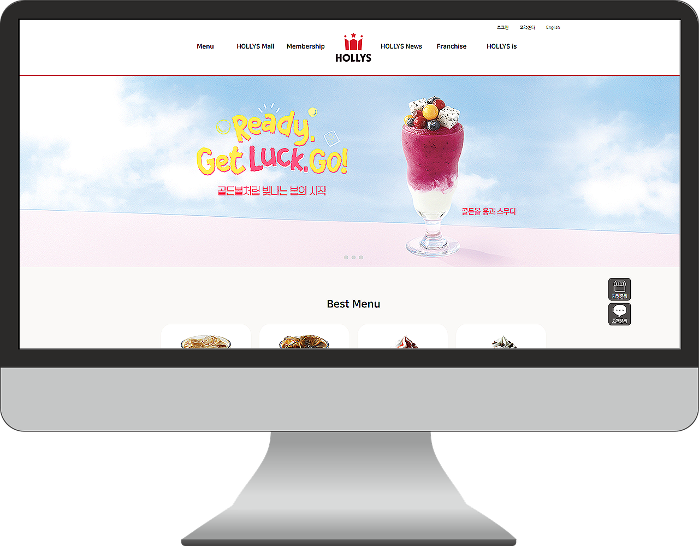
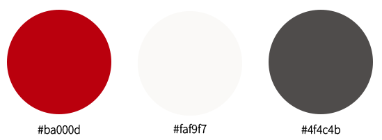

# HOLLYS RENEWAL

## 📢 About
📆 제작 기간 : 2024.03 ~ 2024.04  
👤 제작 인원 : 1명

## ⚙️ Tools
- html
- css
- javascript

## 🍀 Concept
글씨 크기를 키워 가독성을 높였으며, 한 화면에 하나의 카테고리만 표시되도록 디자인하여 사용자가 정보를 쉽게 얻을 수 있도록 하였습니다. 
또한, 중복되는 부분을 줄여 페이지의 명확성과 효율성을 높였습니다.

## 🎨 Color

## 💡 기능 설명
- 메인 배너가 자동으로 넘어가는 슬라이드 기능을 구현했습니다.

## ☠️ 개선해야 할 점
1. css와 javascript를 활용하여 애니메이션 적용하기  
  ➡️ 애니메이션 효과를 적용하는 방법을 배우고 있던 단계였기 때문에 역동적인 웹 페이지가 구현되지 않았습니다.
2. 반응형 웹으로 제작하기  
  ➡️ 제작 당시에는 반응형 웹을 구현할 준비가 되어 있지 않아 PC 버전만 제작되었습니다. 반응형 웹을 구현하는 방법에 대한 학습이 이루어지지 않은 상태였습니다.
 
## 🌈 소감
처음으로 디자인부터 코딩까지 모두 혼자 해내는 과정에서 힘든 시간도 있었고 헤매기도 했습니다.
완성된 웹 페이지를 보게 되었을 때 미흡한 부분도 있어 아쉬움이 있었지만, 그럼에도 불구하고 큰 성취감을 느꼈습니다. 이를 통해 앞으로 더 나은 결과물을 만들기 위해 더욱 노력하겠다는 다짐을 하게 되었습니다.
